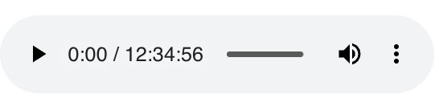

# Set Webm Duration

write duration into webm blob

```
import { setWebmDuration } from '@ozean/set-webm-duration'

const audioBuffer = await audioBlob.arrayBuffer()

const newAudioBuffer = setWebmDuration(audioBuffer, 45296 * 1000)

const newAudioBlob = new Blob([newAudioBuffer])

document.querySelector("audio")!.src = URL.createObjectURL(newAudioBlob)
```


